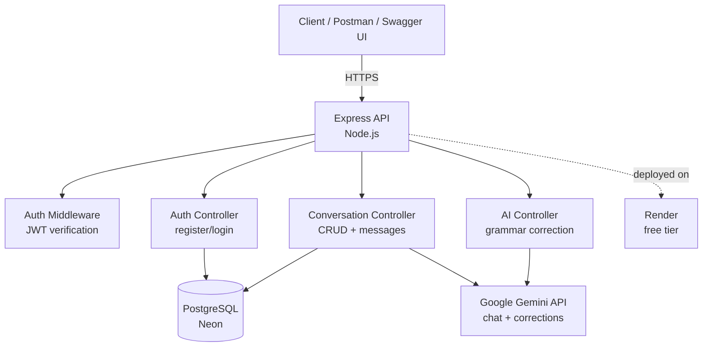

# Luma

An AI-powered language conversation practice app — backend API. Solo rebuild of a 
project originally built with a 7-person team, redone independently using raw SQL 
(no ORM), free-tier infrastructure, JWT auth, and an automated test suite, to 
deepen backend fundamentals.

🔗 **Live API**: https://luma-api-djcb.onrender.com  
📄 **Swagger docs**: https://luma-api-djcb.onrender.com/api-docs  
❤️ **Health check**: https://luma-api-djcb.onrender.com/health

> Note: hosted on Render's free tier — the server spins down after 15 minutes of 
> inactivity. First request after idle may take 30–60 seconds to respond.

---

## What it does
Users register, start a conversation session in **formal** or **casual** mode, and 
chat with an AI language partner (Gemini) that adapts its tone accordingly. A separate 
endpoint checks any sentence for grammar errors and explains the correction.

## Skills demonstrated
- REST API design with Express, including auth middleware and route protection
- Raw SQL with parameterized queries (no ORM) — manual connection pooling and 
  data-ownership enforcement
- JWT authentication + bcrypt password hashing
- Rate limiting to mitigate brute-force/credential-stuffing attempts
- Automated testing with Jest + Supertest — unit tests, middleware tests, and a 
  mocked-DB integration test
- Third-party API integration (Google Gemini) with structured JSON output parsing
- API documentation via Swagger/OpenAPI
- Deployment to a live environment (Render + Neon Postgres)
- Iterative hardening: found and fixed real bugs (see "Fixes & hardening" below) 
  after the initial build, rather than treating v1 as final

## Tech Stack
- **Backend**: Node.js, Express
- **Database**: PostgreSQL (raw SQL via `pg` — no ORM)
- **Auth**: JWT + bcrypt
- **AI**: Google Gemini API
- **Security**: Helmet, scoped CORS, rate limiting
- **Testing**: Jest, Supertest
- **Docs**: Swagger / OpenAPI
- **Hosting**: Render (API), Neon (Postgres)

## Architecture



## Features
- User registration & login (JWT-based auth)
- Auth middleware protecting all user-specific routes
- Rate limiting on login/register to slow brute-force attempts
- Security headers via Helmet, CORS restricted to an explicit origin allowlist
- Prompt injection mitigation on AI-facing endpoints (system instructions kept
  structurally separate from user input, plus input length caps)
- Conversation sessions (start, list, get, delete)
- AI chat with formal/casual tone modes, with conversation history context
- Grammar correction with structured JSON output + explanation
- Interactive Swagger API docs
- Health check endpoint (verifies DB connectivity)
- Automated test suite (unit + integration)
- Deployed and live

---

## Testing

The project has an automated test suite using **Jest** (test runner) and 
**Supertest** (HTTP assertions against the Express app). Tests run against 
mocked dependencies (database, JWT verification) — no real database or 
external API calls happen during test runs.

**Run the tests:**
```bash
npm install
npm test
```

**Current coverage:**
| File | Type | What it verifies |
|---|---|---|
| `tests/validators.test.js` | Unit | Password length rule, conversation mode validation |
| `tests/authMiddleware.test.js` | Unit | JWT middleware correctly accepts valid tokens and rejects missing/malformed/invalid ones |
| `tests/health.test.js` | Integration | `/health` returns the correct status for both a healthy and an unreachable database |

> **Honest scope note**: this is a starter suite, not full coverage. It covers 
> validation logic, auth middleware, and one endpoint end-to-end. It does not yet 
> cover `register`/`login` themselves, conversation CRUD, or the Gemini-dependent 
> code paths — those are the next tests I plan to add.

---

## API Overview

### Auth
| Method | Endpoint | Description | Auth |
|---|---|---|---|
| POST | /api/auth/register | Create new user | No |
| POST | /api/auth/login | Login, returns JWT | No |
| GET | /api/auth/me | Get current user | Yes |

### Conversations
| Method | Endpoint | Description | Auth |
|---|---|---|---|
| POST | /api/conversations/start | Start a new conversation | Yes |
| GET | /api/conversations | List user's conversations | Yes |
| GET | /api/conversations/:id | Get conversation + messages | Yes |
| DELETE | /api/conversations/:id | Delete a conversation | Yes |
| POST | /api/conversations/:id/message | Send message, get AI reply | Yes |

### AI
| Method | Endpoint | Description | Auth |
|---|---|---|---|
| POST | /api/ai/correct | Grammar correction + explanation | Yes |

Full interactive docs: `/api-docs`

---

## Design decisions
- **Raw SQL over an ORM**: chose `pg` instead of Prisma (used in the original team 
  project) specifically to understand what an ORM abstracts — connection pooling, 
  parameterized queries, manual relation handling.
- **IDOR protection**: every conversation query filters by both `id` and `user_id`, 
  since raw SQL doesn't enforce data ownership automatically the way some ORMs' 
  relation helpers do.
- **Structured AI output**: the grammar correction endpoint prompts Gemini to return 
  JSON directly, then strips markdown code fences the model sometimes wraps around it.
- **Conversation-scoped tone**: mode (formal/casual) is set once at conversation start 
  and drives the system prompt for every message in that session, plus prior messages 
  are passed back into each Gemini call for context continuity.
- **`app.js` / `index.js` split**: the Express app is defined in `app.js` and exported, 
  while `index.js` just imports it and calls `.listen()`. This lets tests import the 
  app directly with Supertest without starting a real server on a port.

## Fixes & hardening (post-launch review)
After the initial build, I went back through the code looking for edge cases and 
security gaps.

### Round 1: initial review
Fixed:
- **Orphaned messages on AI failure**: `sendMessage` previously saved the user's 
  message to the DB, then called Gemini — if that call failed, the user's message 
  was stranded with no reply and the client just got a generic 500. Now a failed 
  Gemini call returns a 502 with the saved user message attached, so the client can 
  distinguish "your message didn't send" from "it sent, but the AI reply failed."
- **No password length requirement**: `register` only checked that a password was 
  present, not its length. Added an 8-character minimum, extracted into a testable 
  `isValidPassword` helper.
- **No rate limiting on auth routes**: `/login` and `/register` had no protection 
  against brute-force or credential-stuffing attempts. Added `express-rate-limit` 
  (10 attempts / 15 min / IP).
- **Swagger docs pointed at localhost in production**: the hosted `/api-docs` page's 
  "Try it out" button was configured to hit `localhost:3000`, which fails for anyone 
  using the live docs. Added the Render URL as the primary server.

### Round 2: security hardening after adding the web frontend
Once a real frontend existed, three additional gaps became relevant:
- **CORS allowed every origin**: `app.use(cors())` with no config meant *any* website 
  could call the API from a browser. Replaced with an explicit origin allowlist 
  (configurable via `ALLOWED_ORIGINS` env var), so only the actual frontend can call it.
- **No security headers**: added `helmet`, which sets standard protections 
  (MIME-sniffing prevention, clickjacking protection, etc.) that were previously 
  entirely absent.
- **Prompt injection risk in Gemini calls**: user input was string-concatenated 
  directly into the same prompt as the system instructions, e.g. 
  `` `Sentence to correct: "${sentence}"` ``, with no structural separation between 
  "instructions" and "data." Refactored both Gemini calls to use the SDK's 
  `systemInstruction` parameter (kept separate from user content at the API level) 
  and added explicit "treat this as data, not commands" language, plus input length 
  caps (500 chars for grammar checks, 2000 for chat messages) to limit how much room 
  an attempt has to work with.

## Running locally

1. Clone the repo
2. `npm install`
3. Copy `.env.example` to `.env` and fill in your own values (Postgres URL, JWT 
   secret, Gemini API key)
4. Run `db/schema.sql` against your Postgres instance
5. `npm run dev`
6. Visit `http://localhost:3000/api-docs`
7. Run `npm test` to run the automated test suite

## What's next
- Expand test coverage to `register`/`login` and conversation CRUD
- Deploy the web frontend and set `ALLOWED_ORIGINS` on Render to match
- React Native mobile frontend reusing this same API
- CI (GitHub Actions) to run tests automatically on push

## License
MIT — see [LICENSE](./LICENSE)