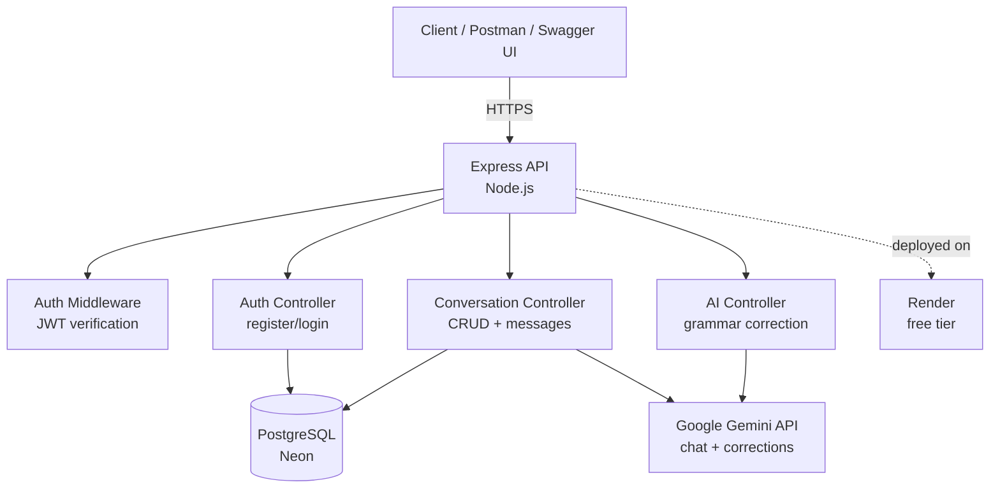

# Luma

An AI-powered language conversation practice app — backend API. Solo rebuild of a 
project originally built with a 7-person team, redone independently using raw SQL 
(no ORM), free-tier infrastructure, and JWT auth to deepen backend fundamentals.

🔗 **Live API**: https://luma-api-djcb.onrender.com  
📄 **Swagger docs**: https://luma-api-djcb.onrender.com/api-docs  
❤️ **Health check**: https://luma-api-djcb.onrender.com/health

> Note: hosted on Render's free tier — the server spins down after 15 minutes of 
> inactivity. First request after idle may take 30–60 seconds to respond.

## What it does
Users register, start a conversation session in **formal** or **casual** mode, and 
chat with an AI language partner (Gemini) that adapts its tone accordingly. A separate 
endpoint checks any sentence for grammar errors and explains the correction.

## Tech Stack
- **Backend**: Node.js, Express
- **Database**: PostgreSQL (raw SQL via `pg` — no ORM)
- **Auth**: JWT + bcrypt
- **AI**: Google Gemini API
- **Docs**: Swagger / OpenAPI
- **Hosting**: Render (API), Neon (Postgres)

## Architecture

[diagram goes here — see below]

## Features
- User registration & login (JWT-based auth)
- Auth middleware protecting all user-specific routes
- Conversation sessions (start, list, get, delete)
- AI chat with formal/casual tone modes, with conversation history context
- Grammar correction with structured JSON output + explanation
- Interactive Swagger API docs
- Health check endpoint (verifies DB connectivity)
- Deployed and live

## API Overview

### Auth
| Method | Endpoint | Description | Auth |
|---|---|---|---|
| POST | /api/auth/register | Create new user | No |
| POST | /api/auth/login | Login, returns JWT | No |
| GET | /api/auth/me | Get current user | Yes |

### Conversations
| Method | Endpoint | Description | Auth |
|---|---|---|---|
| POST | /api/conversations/start | Start a new conversation | Yes |
| GET | /api/conversations | List user's conversations | Yes |
| GET | /api/conversations/:id | Get conversation + messages | Yes |
| DELETE | /api/conversations/:id | Delete a conversation | Yes |
| POST | /api/conversations/:id/message | Send message, get AI reply | Yes |

### AI
| Method | Endpoint | Description | Auth |
|---|---|---|---|
| POST | /api/ai/correct | Grammar correction + explanation | Yes |

Full interactive docs: `/api-docs`

## Design decisions
- **Raw SQL over an ORM**: chose `pg` instead of Prisma (used in the original team 
  project) specifically to understand what an ORM abstracts — connection pooling, 
  parameterized queries, manual relation handling.
- **IDOR protection**: every conversation query filters by both `id` and `user_id`, 
  since raw SQL doesn't enforce data ownership automatically the way some ORMs' 
  relation helpers do.
- **Structured AI output**: the grammar correction endpoint prompts Gemini to return 
  JSON directly, then strips markdown code fences the model sometimes wraps around it.
- **Conversation-scoped tone**: mode (formal/casual) is set once at conversation start 
  and drives the system prompt for every message in that session, plus prior messages 
  are passed back into each Gemini call for context continuity.

  ## Architecture

## Running locally

1. Clone the repo
2. `npm install`
3. Copy `.env.example` to `.env` and fill in your own values (Postgres URL, JWT 
   secret, Gemini API key)
4. Run `db/schema.sql` against your Postgres instance
5. `npm run dev`
6. Visit `http://localhost:3000/api-docs`

## What's next
- Web frontend
- Possible React Native mobile app reusing this same API

